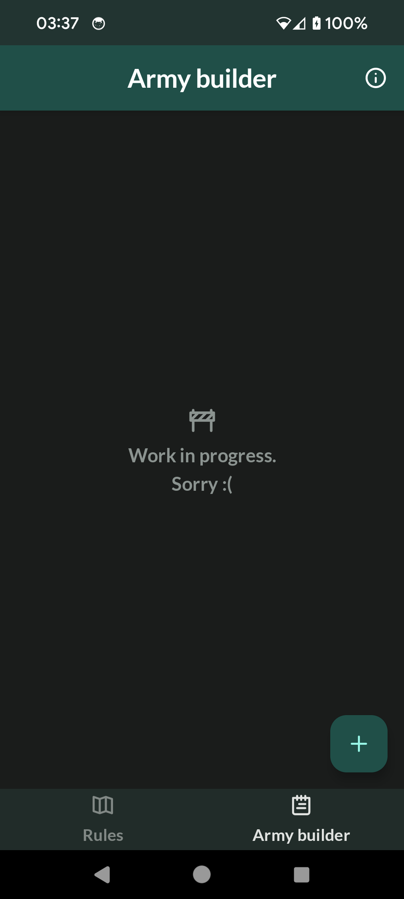

# :scroll::game_die: Warmaster 

A personal tabletop wargaming companion app 

## :steam_locomotive: The latest release
The latest release can be found right [here](https://github.com/Aredruss/Warmaster/releases)

## :tv: Previews

| The factions | The detachments  | The units  | The unit info | WIP |
|--|---|---|---|---|
||||||

## :ocean: Planned stuff
+ A full fledged army builder
+ Digital dice rolls
+ Game statistics

## :building_construction: Built With
- [Kotlin](https://kotlinlang.org/) - First class and official programming language for Android development.
- [Koin](https://insert-koin.io/) - A smart Kotlin dependency injection librar  
- [Coroutines](https://kotlinlang.org/docs/reference/coroutines-overview.html) - For asynchronous work and more..
- [Android Architecture Components](https://developer.android.com/topic/libraries/architecture) - A collection of libraries that help you design robust, testable, and maintainable apps.
    - [Flow](https://kotlinlang.org/docs/reference/coroutines/flow.html) - A flow is an asynchronous version of a Sequence, a type of collection whose values are lazily produced.
    - [ViewModel](https://developer.android.com/topic/libraries/architecture/viewmodel) - Stores UI-related data that isn't destroyed on UI changes.
    - [Room](https://developer.android.com/topic/libraries/architecture/room) - SQLite object mapping library.
    - [Jetpack Navigation](https://developer.android.com/guide/navigation) - Navigation refers to the interactions that allow users to navigate across, into, and back out from the different pieces of content within your app
- [Jetpack Compose](https://developer.android.com/jetpack/compose) - Android’s modern toolkit for building native UI.
- [Figma](https://figma.com/) - Figma is a vector graphics editor and prototyping tool which is primarily web-based.

## :house: Architecture
This app uses the [MVVM](https://developer.android.com/jetpack/docs/guide#recommended-app-arch) architecture.


##  :warning: Important
```
This app is for my personal use only.
I do not intend to share it or its functions with anyone.
This page acts as personal project notes, and the releases help me organize my work.
All the data is collected by myself and myself only.
Don't use this app. Don't recommend it to your friends.
```
